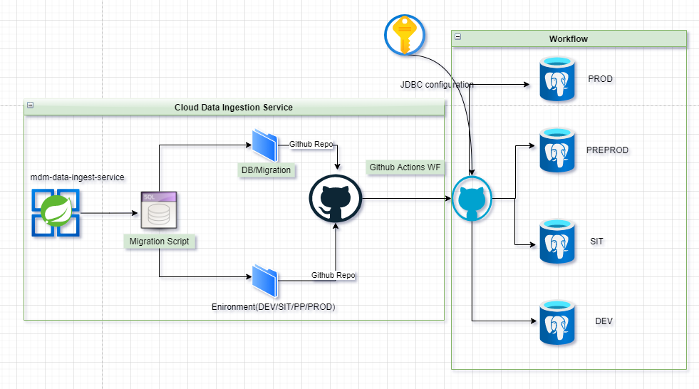

# Data Migration and Versioning

### Data Ingestion service enables

1. Data migration
2. Versioning
3. Data synchronization between multiple environment
4. Specific environment migration through workflows

### Data Migration Steps

- #### Script common for all environment

    - Add script in sql file under *db/migrations*

- #### Environment specific script

    - Add script in sql file under *{{env}}* specific folder

### Naming Conventions

| Migration Name | Pattern                                   | Version enabled | Example                  | Description |
| -------------- | ----------------------------------------- | --------------- | ------------------------ | ----------- |
| Versioned      | V{version_number}__change_description.sql | *true*          | V1.1.0__Add_ew_table.sql |             |
| Undo           | U{version_number}__change_description.sql | *true*          | U1.1__Fix_indexes.sql    |             |
| Repeatable     | R__change_description.sql                 | *false*         | R__My_view.sql           |             |

### Environments

- local : H2 database has been configured as default profile to test scripts in local
    - Enable spring-boot-web to enable server in *pom.xml*
    - Data changes can be monitored at : `http://localhost:8080/h2-console`
- dev, sit, pp , prod
- Execution command  `mvn spring-boot:run -Dspring.run.profiles={env}`
- Except local environment , other environment get jdbc connection parameters through azure keyvault

### GitHub Actions Workflow (data-ingestion-wf)

In order to promote script change to any environment , GitHub workflow needs to be triggered, where few parameters are mandatory

- Change description - Change which needs to be promoted
- Environment - migration environment
- For DEV, SIT : *develop* is the default branch
- For PP and Prod : *main* branch should be selected from dropdown
- Workflow requires approval for every environment and it will run only after getting it approved

### Tools :

-  Spring Boot, Flyway, AzureKeyVault, H2DB, Postgres

